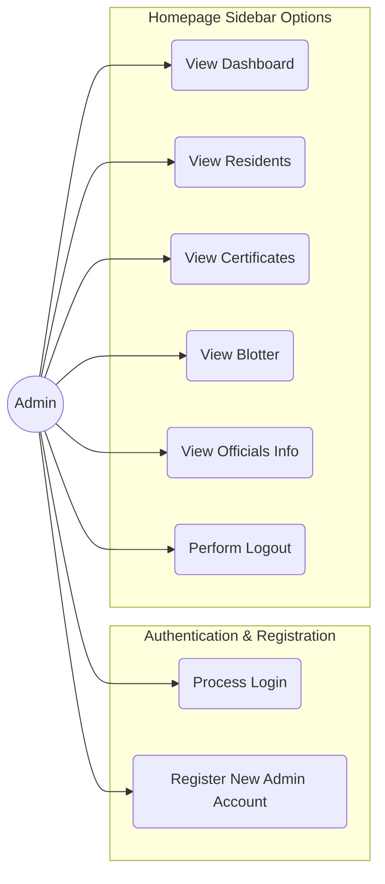

# Use Case Diagram: Authentication & Navigation

This diagram focuses on the use cases implemented in `LoginFrame.java`, `SignUpFrame.java`, and the navigation options within `Homepage.java`.

### Detailed Mapping to Code Files:

#### 1. Login & Registration
- **Process Login:** Handled in `LoginFrame.java` via the `login()` method and `logBtn`.
- **Register New Admin Account (Add):** Handled in `SignUpFrame.java` via `signupBtnActionPerformed`.

#### 2. Homepage Sidebar Options (`Homepage.java`)
The sidebar provides the following navigation options via mouse click events:
- **View Dashboard:** Triggered by `dashboardLabel` or `dashbordIcon`.
- **View Residents:** Triggered by `reslabel` or `residentsIcon`.
- **View Certificates:** Triggered by `certLabel` or `certsIcon`.
- **View Blotter:** Triggered by `blotterLabel` or `blotterIcon`.
- **View Officials Info:** Triggered by `officialsLabel` or `officialsIcon`.
- **Perform Logout:** Handled by `signOutLbl` using the `toLogOut()` method and animation logic.
